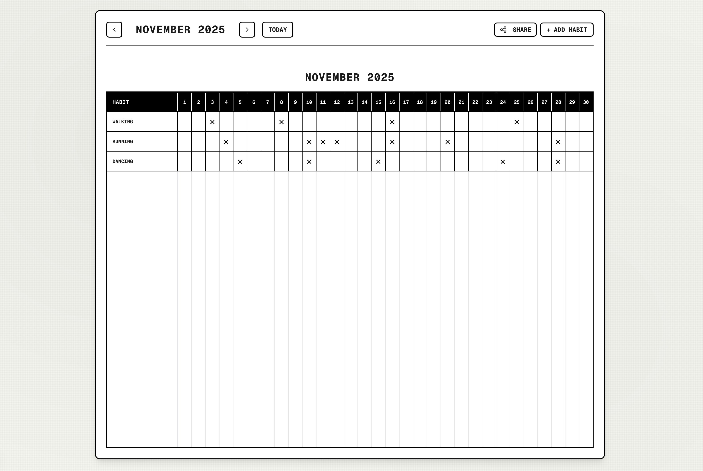

# Aesthetic Habit Tracker

A clean and minimalist habit tracking application designed to help you build effective daily routines and document personal highlights.


> *Please add a screenshot of your app here.*

## Features

- **Visual Habit Tracking** - Track multiple habits using an intuitive calendar grid
- **Customizable Colors** - Personalize each habit with distinct color coding
- **Memorable Moments** - Document important memories alongside your habits
- **Privacy First** - All user data is stored locally in your browser
- **Responsive Design** - Optimized for both desktop and mobile devices
- **Share Progress** - Export and share your habit grid as an image

## Quick Start

```bash
# Install dependencies
npm install

# Run development server
npm run dev

# Open http://localhost:3000
```

## How to Use

### Adding a Habit
1. Click the **"Add"** button in the Habits section.
2. Enter the name of your habit (for example: "Morning Yoga", "Read 30 min").
3. Choose a color to help identify the habit.
4. Begin tracking.

### Tracking Daily
- Click any day's checkbox to mark a habit as complete.
- Navigate between months using the arrow buttons.
- Use the **"Today"** button to return to the current month.

### Recording Moments
- Click **"Add"** in the Memorable Moments section to record a special memory.
- Write about what made your day meaningful.
- View your memories over time.

## Customization

### Modify Theme
You can update CSS variables in `app/globals.css` to further customize the application's visual style.

## Deployment

### Deploy to Vercel
[](https://vercel.com/new)

```bash
# Build for production
npm run build
npm start
```

## Tips

- Data syncs automatically to your browser's local storage.
- For consistency, consider starting with 2-3 habits.
- Use the export button to share your progress.
- Reset all app data by clearing your browser storage if required.

## License

[MIT License](LICENSE) — Free for personal and commercial use.

## Acknowledgments

This project is built with modern web technologies and inspired by the principle of simple, effective habit tracking.
